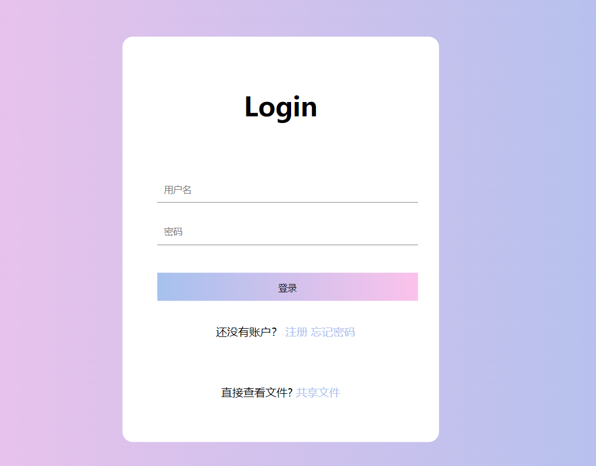

# 实验报告

#### 1、允许用户注册到系统

- 修改了相关的html，添加了一些css样式，使得界面好看（详情请见html代码）

  改动前的界面：

  

  改动后的界面：

  

- 用户名的合法字符集范围：中文、英文字母、数字

  - 在register.py文件里进行用户名设定的修改，使用[正则表达式](https://blog.csdn.net/m0_67354902/article/details/123577026)可以对用户名进行设定
  - 类似：-、_、.等合法字符集范围之外的字符不允许使用

  ```bash
  username_pattern = re.compile(r'[\u4E00-\u9FA5A-Za-z0-9]{2,36}$')
  ```

- 用户口令长度限制在36个字符之内

  - 在register.py文件里进行密码设定的修改，用[正则表达式](https://blog.csdn.net/m0_67354902/article/details/123577026)进行密码的设定
  - 对用户输入的口令进行强度校验，禁止使用弱口令

  ```bash
  password_pattern = re.compile(r'(?=.*[a-z])(?=.*[A-Z])(?=.*\d)[\s\S]{8,36}')
  ```

- 解决了注册不合法之类的报错，原先用户名为错误格式和密码错误的报错没有相互一一对应，现在进行了一些改进之后，就可以实现相互对应了。（详情请见register.py）

  

#### 2、使用合法用户名和口令登录系统

- 禁止使用明文存储用户口令 【PBKDF2、散列算法、慢速散列、针对散列算法（如MD5、SHA1等）的攻击方法】

  - 这里我们使用了sha512算法对密码进行加密存储。为了防止撞库的破解方式，采用了盐值进行加密；

  - 存储的口令即使被公开，也无法还原/解码出原始明文口令；

  - 用户在登录时输入的密码会和数据库中存储的密码进行比对，比对正确即可登录成功。

    

#### 3、安全的忘记口令 / 找回密码功能

- 新设置了忘记密码功能界面，并且将其命名为reset.html和reset.py，并进行了相关代码的编写
  - 由于忘记密码需要重新将新设置的密码存入数据库里，所以如果忘记密码的话，需要先删除数据库里的password，也就是在user.py里新添加reset_user函数，然后再由reset.py对reset_user函数进行引用，从而就可以达到更改密码的目的；
  - 然后重新登录login界面或者进行刷新，就可以使用新修改的密码重新进行登录了。


#### 4、文件下载过期策略

- 由于文件下载的选项是一个链接，所以我们直接采用了在前端使用JAVASCRIPT的方式使得链接可以在短短5秒之后失去效益，从而无法点击使用。如果没有及时点击链接的话，直接对网站进行刷新操作就可以重新获得5秒权限


```
<script type="text/javascript">
        var p = "";

        function init(i) {
            var div = document.getElementById("test");
            div.innerHTML = i + "秒后失效";
            i--;
            p = window.setTimeout(function() {
                init(i)
            }, 1000);
            if (i == -1) {
                change();
            }
        }

        function change() {
            window.clearTimeout(p);
            var div = document.getElementById("test");
            div.innerHTML = "已失效";
            document.links[2].href = "javascript:alert('已失效')";
            document.links[3].href = "javascript:alert('已失效')";
        }
        window.onload = function() {
            init(5);
        };
    </script> 
```


#### 5、配置证书和安装证书

###### 配置证书：

- 由于linux系统自带openssl比较好操作，我们利用了阿里云自带的centos进行操作。

- 配置过程中的注意事项：
  - 配置证书时最好先在root下新建一个文件夹再进行相关操作，不然最后导出证书时会附带很多不必要的文件。
  - 配置证书时会需要输入`countryname`,`cityname`等一系列选项，这些选项中除了`common name`在最后一级证书的配置中必须输入为自己设定的域名外，其余可以随便输入(因为是自签名的证书)。
  - 输入的域名为自己在本地设置的域名，例如`ac-flask-demo.me`，域名需要在本地host文件里将127.0.0.1这个ip绑定域名。
    - host文件位置：`c:/windows/system32/drivers/etc/host`
  - 最后用scp -r命令将配置好的证书文件copy到本地

###### 安装证书：

- 将copy到本地的文件夹打开，点击全部的csr文件，会弹出证书安装向导，一直点下一步安装即可。

- 再到 `__init__.py  ` 里，把对应的ssl_context改为设定好的最后一级的服务器证书

  ```
  ssl_context = ('server.crt', 'server.key')
  ```

- 然后打开浏览器【这里以谷歌浏览器为例】，设置-隐私设置与安全性-安全-管理证书（或者直接搜索证书就能得到），然后点开【受信任的根证书颁发机构】，将自己配置的根证书导入进去，通过docker进行登录，在对应的网址上就可以看见三级证书已经配好，没有问题了。

  

  


#### 6、写总结报告及录制小组视频（当然是在小组同学的帮助及合作下进行的）


### 遇到的问题：

1、关于报错：sqlalchemy.exc.StatementError：(builtins.TypeError) Python DateTime类型只接受SQLite datetime和date对象作为输入 

网址：https://cloud.tencent.com/developer/ask/sof/540044


2、关于报错：NameError: name 'request' is not defined

```
from flask import Flask, Response
import requests
import hashlib

app = Flask(__name__)
salt = "UNIQUE_SALT"
default_name = 'test'

@app.route('/', methods=['GET', 'POST'])
def mainpage():

    name = default_name
    if request.method == 'POST':
        name = request.form['name']

    salted_name = salt + name
    name_hash = hashlib.sha256(salted_name.encode()).hexdigest()

    header = '<html><head><title>Identidock</title></head><body>'
    body = '''<form method="POST">
              Hallo <input type="text" name="name" value="{0}">
              <input type="submit" value="Abschicken">
              </form>
              <p> Du siehst aus wie ein: </p>
             
           '''.format(name, name_hash)
    footer = '</body></html>'

    return header + body + footer

@app.route('/monster/<name>')
def get_identicon(name):

    r = requests.get('http://dnmonster:8080/monster/' \
        + name + '?size=80')
    image = r.content

    return Response(image, mimetype='image/png')

if __name__ == '__main__':
    app.run(debug=True, host='0.0.0.0')
```

网址：https://stackoverflow.com/questions/41487473/nameerror-name-request-is-not-defined


3、未解决的HTTPS网络链接不安全的问题

我们未能解决网址不安全的问题，尝试了很多种情况都未能解决，依旧在开头存在不安全的红色警告

网址1：https://www.likecs.com/show-282540.html

网址2：https://baijiahao.baidu.com/s?id=1730410587810800815&wfr=spider&for=pc


4、CA证书踩坑总结：

坑1：配置server.[xml](https://so.csdn.net/so/search?q=xml&spm=1001.2101.3001.7020)（PFX证书的）

```
<Connector port="443"
    protocol="org.apache.coyote.http11.Http11NioProtocol" 
    
    #此处，官方文档为Http/1.1，笔者测试时不成功，故更换了本文中的协议
    
    SSLEnabled="true"
    scheme="https"
    secure="true"
    keystoreFile="domain name.pfx"   
    #此处keystoreFile代表证书文件的路径，请用您证书的文件名替换domain name。
    keystoreType="PKCS12"
    keystorePass="证书密码"   #请用您证书密码替换文件中的内容。
    clientAuth="false"
    SSLProtocol="TLSv1+TLSv1.1+TLSv1.2"
    ciphers="TLS_RSA_WITH_AES_128_CBC_SHA,TLS_RSA_WITH_AES_256_CBC_SHA,
    TLS_ECDHE_RSA_WITH_AES_128_CBC_SHA,TLS_ECDHE_RSA_WITH_AES_128_CBC_SHA256,
    TLS_RSA_WITH_AES_128_CBC_SHA256,TLS_RSA_WITH_AES_256_CBC_SHA256"/>
```

坑2：HTTPS调试中自签名证书错误ERR_CERT_COMMON_NAME_INVALID的解决方法

**解决方法**
生成证书的时候需要添加上备用名称(subjectAltName)扩展字段。
使用openssl添加subjectAltName扩展;
创建一个文件ext.ini，填入以下内容：

```
basicConstraints = CA:FALSE
keyUsage = nonRepudiation, digitalSignature, keyEncipherment
subjectAltName = @alt_names

[alt_names]
DNS.1 = *.dyxmq.cn
DNS.2 = *.maqian.xin
DNS.3 = *.maqian.io
DNS.4 = *.maqian.co
DNS.5 = *.maqian.cn
```

在DNS.x的地方填写上自己的域名，如果多个域名，可以按照规律DNS.1/DNS.2/DNS.3/…来添加,同时还支持IP地址的形式，填入IP.1 = x.x.x.x就可以了。

签发证书的时候带上参数：

```
openssl x509 ... -extfile ext.ini
```


### 参考网址：

【openssl生成证书链多级证书】https://www.cnblogs.com/gsls200808/p/4502044.html

【创建自签名CA和SSL证书】https://www.dyxmq.cn/network/create-self-sign-ca-and-certificate.html

【python中的加密算法（md5、sha512）】https://www.cnblogs.com/zhangqiboke/p/15416420.html

【sqlalchemy如何批量删除多条数据】https://www.cnblogs.com/shengulong/p/6639581.html

【使用OpenSSL生成自签名证书相关命令】https://blog.csdn.net/fengbingchun/article/details/107386847