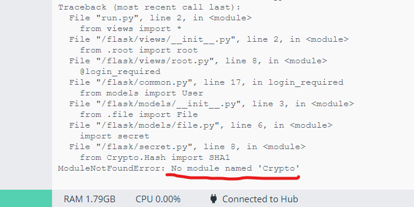

# 密码学小学期实验报告

## 实验内容及代码分析改进

### 1. 基于网页的用户注册与登录系统

- **使用https绑定证书到域名而非IP地址 【 *PKI* *X.509* 】**

### 2. 基于网页的文件上传加密与数字签名系统

- **限制文件大小：小于 10MB**

  在file.py中，对文件content的大小进行判断，若是大于等于10MB则文件不能上传。

- **限制文件类型：office文档、常见图片类型**

  在_init_.py中，对文件类型进行限制，若获取到的上传文件类型不在默认文件类型的范畴中，则文件无法上传。

- **匿名用户禁止上传文件**

  当用户没有登录时为匿名用户，在file.py中，若要进行文件的上传操作，首先要对用户是否登陆进行验证（login_required）。如果用户为匿名用户，则此时用户无法访问file_upload.html页面进行上传操作，仅有访问shared_file.html页面的权限，该页面上匿名用户只能下载加密后的文件和签名后的文件，而没有对文件进行上传操作的选项。

- **对文件进行对称加密存储到文件系统，禁止明文存储文件** 

  用户将文件上传后，服务器端在file.py中对文件进行加密，之前在user.py文件里用网站公钥加密过对称密钥，此处进行文件加密时先用网站私钥解密出对称密钥，再用解密得到的对称密钥对文件进行加密。这样就实现了文件的加密，禁止了直接将文件以明文形式存储。

- **系统对加密后文件进行数字签名**
- **（已选）文件秒传：服务器上已有的文件，客户端可以不必再重复上传了**

  在file.py中对用户上传的文件进行判断，如果已存在该文件，则此文件上传失败。

### 3. 基于网页的加密文件下载与解密

- **提供匿名用户加密后文件和关联的数字签名文件的下载**

  在file.py中读取经对称密钥加密后的加密文件并将type定义为encrypted，读取签名文件并将type定义为signature。当匿名用户进入网站后，可以访问shared_file.html页面。在该页面中，通过超链接中的type能够定位到上述加密文件或数字签名文件，以提供给匿名用户下载。

  - 客户端对下载后的文件进行数字签名验证 【 *非对称（公钥）加密* *数字签名* 】
  - 客户端对下载后的文件可以解密还原到原始文件 【 *对称解密* *密钥管理* 】
  
  在本地创建symmetric.py文件完成客户端对下载后文件解密还原的过程。分别打开从服务器端获取到的加密文件和对称密钥，再用得到的对称密钥进行解密得到明文。
  
- **提供已登录用户解密后文件下载**

  在file.py中，先用网站私钥解密得到对称密钥，再由对称密钥对加密文件解密得到明文。已登录用户可以访问file.html页面，通过type=plaintext定位到file.py中相关函数以下载解密文件。

- **下载URL设置有效期（限制时间或限制下载次数），过期后禁止访问**

  在file.html页面中添加script脚本，编写change()函数对下载时限进行控制。对每一个超链接限定下载时限，从用户登录下载页面后开始倒计时，当倒计时结束后下载链接失效，用户无法下载。

- **提供静态文件的散列值下载，供下载文件完成后本地校验文件完整性 【 *散列算法* 】**

  在file.py中，对文件计算散列值。已登录用户可以访问file.html页面，通过type=hashvalue定位到file.py中相关函数以下载文件散列值。在本地运行compare.py文件即可验证文件完整性。

## 遇到的问题与解决方案

- 1.无法运行实例python代码。

  初步分析后认为应该运行run.py文件，结果运行后报错。向老师请教并仔细观看视频后，理解了代码的启动过程并通过容器化方案运行代码。此处，用容器的好处就是能快速搭建起环境以运行代码。

- 2.关于密钥安全管理和加密文件的研究

  生成密钥的函数在use.py文件中。此处导入了secert.py文件，通过调用其中的函数先随机生成一个用户的对称密钥与公私钥，再用服务器的公钥加密这些密钥，加密过后的密钥实现了安全存储。在file.py中对文件进行加密，之前在user.py文件里用网站公钥加密过对称密钥，此处进行文件加密时先用网站私钥解密出对称密钥，再拿解密得到的对称密钥对文件进行加密.

- 3.签名

  对文件进行签名的函数是secret.py的sign函数，models下的file.py引用了这个函数，在文件存储后，用网站私钥进行数字签名。函数是运用PyNaCl库实现的，PyNaCl是libsodium库的Python实现。libsodium是一个基于NaCl开发的先进而且易用的加密库，主要用于加密、解密、签名和生成密码哈希等，同样，PyNaCl能够提供数字签名、密钥加密、公钥加密、哈希和消息身份验证、基于密码的密钥派生和密码散列功能。

  过程中，我尝试了用Crypto库进行公私钥签名，但运行后docker显示"No module named 'Crypto'"。尝试了pip install pycryptodome，或者卸载重装，都没有效果。考虑到这个库在5年前就已经不更新了，所以决定使用pynacl。
  
  理论上，在本地应该用到网站公钥进行签名验证。通过查找资料发现，本地需要使用VerifyKey库来进行验签，具体过程是，将作为signing_key的编码后的网站私钥（sk_raw）生成的verify_key，经过verify_key.encode()编码之后，作为网站公钥公开。用户在本地验证时，需要下载网站公钥文件，利用VerifyKey（）还原网站公钥后即可进行验签。

  值得注意的是，若验签不成功，程序会直接报错输出“nacl.exceptions.BadSignatureError: Signature was forged or corrupt”，无法输出“验证成功！”

- 4.密钥安全管理和分配

  用户的对称密钥、私钥和公钥在存储时，是先被服务器端的公钥加密后在存放在数据库中。因此，当服务器调用对称密钥等密钥时，需要服务器先用自己的私钥进行解密，还原出密钥再进行文件加密或密钥下发等操作。

- 5.URL

  最初设计URL下载有效期时尝试过对整个网页设置时间限制，倒计时结束后网页自动跳转。但这显然不符合实验设计的要求。在网上查阅相关资料后，用javascript代码对网页的超链接进行时间控制，倒计时结束后URL失效，用户将不能进行下载。
  一开始是想利用a标签，添加onclick事件来使页面延后5秒返回false，但是没有成功。最后选择Javascript setTimeout和函数解决。

- 6.解密 base64

  对下载的文件进行对称密钥的解密时，起初并没有还原出源文件，而是二进制比特流。查阅资料发现，是因为输出前进行base64编码造成的，去掉相关语句即可。

- 7.证书
  开始选择了python版的证书生成模式，后来改用在centos里用openssl生成证书，出于安全考虑我们生成了四级证书，并且导入到了受信任的根证书/中间证书目录，网站可以和证书相连，但服务器仍显示“链接不安全”的字样。

## 参考资料
1.[Digital Signatures¶](https://pynacl.readthedocs.io/en/latest/signing/)

2.[openssl生成证书链多级证书](https://www.cnblogs.com/gsls200808/p/4502044.html)

3.[HTML中在a标签中添加onclick事件](https://www.cnblogs.com/HadesFX/p/5329923.html#:~:text=HTML%E4%B8%AD%E5%9C%A8a%E6%A0%87%E7%AD%BE%E4%B8%AD%E6%B7%BB%E5%8A%A0onclick%E4%BA%8B%E4%BB%B6%201.%E9%93%BE%E6%8E%A5%E7%9A%84%20onclick%20%E4%BA%8B%E4%BB%B6%E8%A2%AB%E5%85%88%E6%89%A7%E8%A1%8C%EF%BC%8C%E5%85%B6%E6%AC%A1%E6%98%AF%20href%20%E5%B1%9E%E6%80%A7%E4%B8%8B%E7%9A%84%E5%8A%A8%E4%BD%9C%3B%202.%E5%81%87%E8%AE%BE%E9%93%BE%E6%8E%A5%E4%B8%AD%E5%90%8C%E6%97%B6%E5%AD%98%E5%9C%A8%20href,onclick%20%EF%BC%8C%E5%A6%82%E6%9E%9C%E6%83%B3%E8%AE%A9%20href%20%E5%B1%9E%E6%80%A7%E4%B8%8B%E7%9A%84%E5%8A%A8%E4%BD%9C%E4%B8%8D%E6%89%A7%E8%A1%8C%EF%BC%8C%20onclick%20%E5%BF%85%E9%A1%BB%E5%BE%97%E5%88%B0%E4%B8%80%E4%B8%AA%20false%20%E7%9A%84%E8%BF%94%E5%9B%9E%E5%80%BC%3B)

4.[openSSL 生成证书 (三级_证书链) linux](https://blog.csdn.net/AAugust/article/details/102680169)