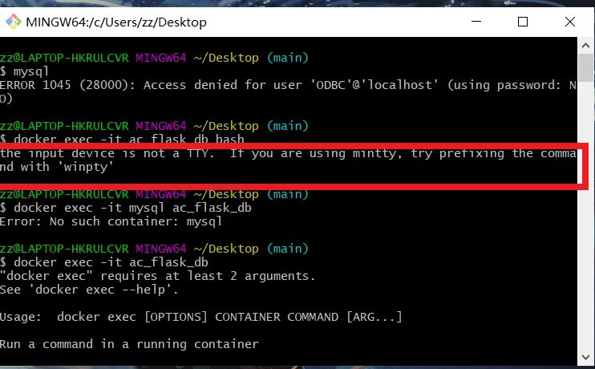

# 分组完成【候选】题目-1 “中传放心传”

这次作业我主要负责的是基于网页的用户注册与登录系统部分，具体的工作如下。

## 实验目的

- [x] 基于网页的用户注册与登录系统（60分）
  - [x] 使用https绑定证书到域名而非IP地址 【 *PKI* *X.509* 】
  - [x] 允许用户注册到系统
    - [x] 用户名的合法字符集范围：中文、英文字母、数字
      - [x] 类似：-、_、.等合法字符集范围之外的字符不允许使用
    - [x] 用户口令长度限制在36个字符之内
    - [x] 对用户输入的口令进行强度校验，禁止使用弱口令
  - [x] 使用合法用户名和口令登录系统
    - [x] 禁止使用明文存储用户口令 【PBKDF2、散列算法、慢速散列、针对散列算法（如MD5、SHA1等）的攻击方法】
    - [x] 存储的口令即使被公开，也无法还原/解码出原始明文口令
  - [x] （可选）安全的忘记口令 / 找回密码功能


## 实验环境

- windows 10
- Docker Desktop
- vscode


## 实验过程

### 一、配置环境(docker)

1、首先去官网下载了docker desktap for windows10

2、因为存在问题，docker是基于linux的，linux是基于virtual box虚拟机的，但是docker是hyper-v，所以说可能会出现docker运行不成功的情况（相关资料这么解释，但是本人实际运行中没有遇到这个问题）

3、更新wsl，[wsl网址](https://blog.csdn.net/weixin_39912640/article/details/120391027)

4.重启电脑，然后打开docker，就发现可以运行了，然后打开docker的setting，增加一下镜像，让运行速度变快。


4、下载docker compose（理论上）,但是本人实际运行过程中并没有下载过它是自带的，运行

```
 docker-compose --version
```

发现已经有docker-compose了，所以就不用下载了。

5.运行docker等代码

```
docker-compose up -d --build

docker ps
#多运行几遍这个，直到（）里变为healthy为止

docker start ac_flask
#启动ac_flask

docker ps
#发现ac_flask,ac_flask_db两个都出现了

```

6.然后浏览器打开网址`https://127.0.0.1/`，然后就发现可以登录了!

7.先注册再登录，注册不能有特殊字符，密码必须包含一个大写字母和数字。


### 二、使用https绑定证书到域名而非IP地址 【 *PKI* *X.509* 】

##### 1.配置证书

- 因为我们的目标是做出一个三级的自签名证书，所以首先下载openssl来进行证书的配置操作。

- 这里我们采用的是，用阿里云自带的centos进行操作，因为linux系统自带openssl比较好操作。

- [具体操作](https://www.cnblogs.com/gsls200808/p/4502044.html)

- 配置过程中需要注意以下事项：

  - 配置证书时最好先在root下新建一个文件夹再进行相关操作，不然最后导出证书时会附带很多不必要的文件。

  - 配置证书时会需要输入`countryname`,`cityname`等一系列选项，这些选项中除了`common name`在最后一级证书的配置中必须输入为自己设定的域名外，其余可以随便输入(因为是自签名的证书)。

  - 输入的域名为自己在本地设置的域名，例如`ac-flask-demo.me`，域名需要在本地host文件里将127.0.0.1这个ip绑定域名。

    - host文件位置：`c:/windows/system32/drivers/etc/host`

    - 绑定格式如下：

      

  - 最后用scp -r命令将配置好的证书文件copy到本地

##### 2.安装证书

- 首先将copy到本地的文件夹打开，点击全部的csr文件，会弹出证书安装向导，一直点下一步安装即可。


- 然后再 `src\config\__init__.py  ` 里，把对应的ssl_context改为设定好的最后一级的服务器证书

  ```
  ssl_context = ('server.crt', 'server.key')
  ```

- 然后打开浏览器【这里以google浏览器为例】，设置-隐私设置与安全性-安全-管理证书（或者直接搜索证书就能得到），然后点开【受信任的根证书颁发机构】，将自己配置的根证书导入进去，再检查一下中间证书是否在【中间证书颁发机构】，最后一级的服务器证书是否在【其他人】里，检查完成后就可以通过docker进行登录，在对应的网址上就可以看见三级证书已经配好，没有问题了。


### 三、允许用户注册到系统

- 修改了相关的html，添加了一些css样式，将界面改的更加美观了点（具体见html代码）

- 在logout登出界面加入了一个刷新界面的功能，用户可以在登出界面后5秒钟自动跳转到登录界面上，当然也可以点击登录的按钮手动登录

  

- 登录进入文件界面是这样的


- 用户名的合法字符集范围：中文、英文字母、数字

  - 在register.py文件里进行用户名设定的修改，用[正则表达式](https://blog.csdn.net/m0_67354902/article/details/123577026)进行用户名的设定
  - 类似：-、_、.等合法字符集范围之外的字符不允许使用

  ```bash
  #更改用户名
  #中文、英文、数字但不包括下划线等符号，2-36位
  username_pattern = re.compile(r'[\u4E00-\u9FA5A-Za-z0-9]{2,36}$')
  ```

- 用户口令长度限制在36个字符之内

  - 在register.py文件里进行密码设定的修改，用[正则表达式](https://blog.csdn.net/m0_67354902/article/details/123577026)进行密码的设定
  - 对用户输入的口令进行强度校验，禁止使用弱口令

  ```bash
  #更改密码格式
  #强密码(以字母开头，必须包含大小写字母和数字的组合，不能使用特殊字符，长度在8-36之间)
  password_pattern = re.compile(r'(?=.*[a-z])(?=.*[A-Z])(?=.*\d)[\s\S]{8,36}')
  ```

- 修改了注册不合法之类的报错，原先用户名为错误格式和密码错误的报错没有一一对应上，现在进行了一些修改。（具体见register.py）


### 四、使用合法用户名和口令登录系统

- 禁止使用明文存储用户口令 【PBKDF2、散列算法、慢速散列、针对散列算法（如MD5、SHA1等）的攻击方法】

  - 存储的口令即使被公开，也无法还原/解码出原始明文口令
  - 这里我使用的是sha512算法对密码进行加密存储。为了防止撞库的破解方式，采用了盐值进行加密。
  - 用户在登录时输入的密码会和数据库中存储的密码进行比对，比对正确即可登录成功
- 当用户名不符合规定时，会报错“用户名不合法”；密码不符合的话，会“密码不合法”，用户被注册过的话，会“该用户已经被注册过了”。
  - 例如：
  
  
  
  ```bash
  from hashlib import sha512
  	#sha512进行加密
      hash = sha512(self.password.data.encode())
      #加盐
      hash.update('admin'.encode('utf-8'))
      return hash.digest
  ```


### 五、安全的忘记口令 / 找回密码功能

- 新设置了忘记密码功能界面，命名为reset.html和reset.py，并进行相关代码的编写

  - 因为忘记密码需要重新将新设置的密码存入数据库里，于是需要先删除数据库里password，所以在user.py里新添加reset_user函数，然后reset.py里引用reset_user函数，从而达到更改密码的目的。
- 只要修改密码，它就会在数据库里删除原来的密码，然后将新的密码填入进去，就达到更改密码的目的了。
  
  ```bash
   @classmethod
      def reset_user(cls, username, hash_password):
          import secret,request
          #通过忘记密码提供的username进行筛选
          user=User.query.filter(User.username == username).first()
          #更改原来的hash_password为现在的hash_password
          user.hash_password=hash_password
          #更新数据库
          db.session.commit()
  ```


### 六、遇到的问题

##### 1.如何把新建的css文件导入到flask中去？

[HTML引入外部css失效解决](https://blog.csdn.net/qq_43211318/article/details/123770611)

在设计html里时，将css文件和html文件主体分离了，虽然在一开始的时候将css导入了html，但是用docker登录网站时却发现

css样式并没有被导入进去。因此怀疑是和flask有关，查找相关资料后发现，需要在html对应的py文件里引入url_for这个库并在html里修改引入css的格式。然后就可以再网页上看到它了。

```
<link rel="stylesheet" href="../css/first.css">
```

##### 2.安装证书时遇到的问题

- 第一次安装证书时采用了gitbash进行配置，遇到的问题是，虽然是三级证书的方法进行配置，但是最后出来的效果并不是三级证书，由此可见，还是需要用openssl进行配置，因此之后采用了阿里云的linux centos进行证书的配置。
- 单单在本地点击安装证书时没有用的，还需要在浏览器中的受信任根证书把配置的根证书导入进去，并且在代码的相应模块将服务器证书绑定好，才能在网页上看见三级证书
- 


##### 3.下载过期策略

通过更改`document.links[2].href = "javascript:alert('已失效')";`其中[]中的数字，可以让一个网页上不同的链接失效。数字的选择参考数组。这里我将时间设为5秒后失效。如果想再次下载的话，可以刷新一下界面。


```js
<script type="text/javascript">
        var p = "";

        function init(i) {
            var div = document.getElementById("test");
            div.innerHTML = i + "秒后失效";
            i--;
            p = window.setTimeout(function() {
                init(i)
            }, 1000);
            if (i == -1) {
                change();
            }
        }

        function change() {
            window.clearTimeout(p);
            var div = document.getElementById("test");
            div.innerHTML = "已失效";
            document.links[2].href = "javascript:alert('已失效')";
            document.links[3].href = "javascript:alert('已失效')";
        }
        window.onload = function() {
            init(5);
        };
</script>
```

##### 4.忘记密码的时候遇到问题

- 在设计忘记密码模块时，首先参考了一下login和register模块的代码写法，然后发现不能重新创建一个用户（login是这样），只需要更改数据库里的密码就行，于是参考了[Python+Flask对MySQL数据库进行增删查改并在页面展示数据](https://blog.csdn.net/weixin_59860683/article/details/121729745)等，在reset_user函数进行更改数据库的操作，从而把新密码替换了旧密码。
- 更改后的无需再次用对称密码进行加密，因为它对称密码加密的内容并不是密码而是别的（这点在数据库中也有体现， encrypted_symmetric_key| encrypted_private_key| encrypted_public_key这三个表头是单独存放在数据库中的，和密码无关），加上那些代码反而会报错。

##### 5.查看mysql结构时，遇到报错

在总报告里查看数据库结构时遇到了问题，查找资料后发现：



 只需要在命令行前边加上 winpty   进容器的时候把/bin/sh或/bin/bash改成 sh 以及 bash就可以了

winpty docker exec -it nacos bash

[具体步骤参考](https://www.jianshu.com/p/6f7845fc153b)


### 七、相关资料

- html相关
  - [css如何清除input默认样式](https://blog.csdn.net/qq_44750892/article/details/120075922)
  - [html网页中如何实现居中效果](https://m.php.cn/article/480975.html)
  - [HTML引入外部css失效解决](https://blog.csdn.net/qq_43211318/article/details/123770611)
  - [flask加载网页时css美化效果加载不出来的解决方法](https://blog.csdn.net/Rover95/article/details/118978763)
- 证书相关
  - [openssl生成证书链多级证书--重要](https://www.cnblogs.com/gsls200808/p/4502044.html)
  - [使用OpenSSL生成自签名证书相关命令](https://blog.csdn.net/fengbingchun/article/details/107386847)
  - [openSSL 生成证书 (三级_证书链) linux](https://blog.csdn.net/AAugust/article/details/102680169)
  - [openssl x509参数介绍（官方完整版）](https://blog.csdn.net/weixin_39565764/article/details/120419199)
  - [创建自签名CA和SSL证书](https://www.dyxmq.cn/network/create-self-sign-ca-and-certificate.html)
  - [Flask之九：Flask启用SSL加密传输](https://www.jianshu.com/p/8acff61b53c5)
  - [CA证书踩得坑](https://blog.csdn.net/QQ736238785/article/details/115852823)
- 安全的存储密钥(sha512，盐值)
  - [用python实现MD5、sha256、sha384、sha512、base64加密](https://blog.csdn.net/weixin_42444693/article/details/104255330)
  - [sha512加密](https://blog.csdn.net/whatday/article/details/106302262/)
  - [Python语言安全密码散列](https://www.nhooo.com/note/qa5qqt.html)
- flask相关
  - [使用Flask实现用户登陆认证的详细过程](https://zhuanlan.zhihu.com/p/23137867)
  - [Python+Flask对MySQL数据库进行增删查改并在页面展示数据](https://blog.csdn.net/weixin_59860683/article/details/121729745)
  - [Python_sqlalchemy——创建、查询、删除、更新一对多的表](https://blog.csdn.net/KK_2018/article/details/113446254)
  - [sqlalchemy批量删除数据、全量删除](https://www.cnblogs.com/shengulong/p/6639581.html)
  - [实验3、Flask数据库操作-如何使用Flask与数据库](https://www.cnblogs.com/liuyangQAQ/p/14762357.html)

- 报错相关
  - [解决python报a bytes-like object is required, not str的方法](https://blog.csdn.net/weixin_42172039/article/details/106262384)
  - [sqlalchemy.exc.StatementError：(builtins.TypeError) Python DateTime类型只接受SQLite datetime和date对象作为输入](https://cloud.tencent.com/developer/ask/sof/540044)
  - [SyntaxError: keyword can't be an expression解决方法](https://www.codeprj.com/blog/a134d31.html)
  - [the input device is not a TTY. If you are using mintty, try prefixing the command with ‘winpty’ 解决方案](https://blog.csdn.net/xiaopang5678/article/details/120527801)
- docker相关
  - [Docker初探之Windows篇](https://www.cnblogs.com/hapgaoyi/p/13423626.html)
  - [Docker Desktop 报错 WSL 2 Kernel update](https://www.cnblogs.com/alunzuishuai/p/16344884.html)
  - [Windows下VirtualBox与Docker冲突](http://www.3656300.com/?post=22)
  - [windows10 docker D盘部署最终解决方案](https://developer.aliyun.com/article/937521)


