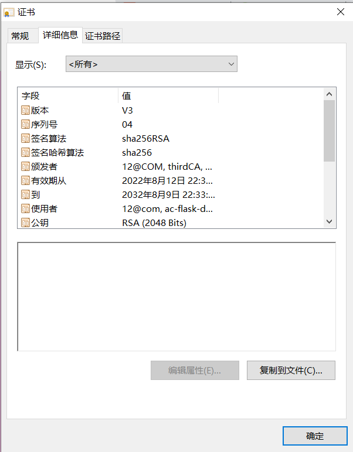
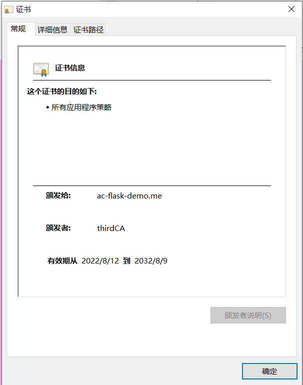

# 总结实验报告

### 仓库链接：https://github.com/lillian-wang512/cryptography-/tree/master

### 视频链接：https://www.bilibili.com/video/BV1pd4y1P7U2/?vd_source=942412bbfd854bdc9c081924f351311d

### 分工：

第一部分：王凌玥、杨玥玥

第二、三部分：蔡宸青、刘婧瑶、王凌玥


## ·    请总结你们的所有已完成功能点

- 基于网页的用户注册与登录系统
  - 使用https绑定证书到域名而非IP地址 【 *PKI* *X.509* 】
  - 允许用户注册到系统
    - 用户名的合法字符集范围：中文、英文字母、数字
      - 类似：-、_、.等合法字符集范围之外的字符不允许使用
    - 用户口令长度限制在36个字符之内
    - 对用户输入的口令进行强度校验，禁止使用弱口令
  - 使用合法用户名和口令登录系统
  - 禁止使用明文存储用户口令 【PBKDF2 散列算法 慢速散列 针对散列算法（如MD5、SHA1等）的攻击方法】
    - 存储的口令即使被公开，也无法还原/解码出原始明文口令
  - （可选）安全的忘记口令 / 找回密码功能
- 基于网页的文件上传加密与数字签名系统
  - 已完成《基于网页的用户注册与登录系统》所有要求
  - 限制文件大小：小于 10MB
  - 限制文件类型：office文档、常见图片类型
  - 匿名用户禁止上传文件
  - 对文件进行对称加密存储到文件系统，禁止明文存储文件 【 *对称加密* *密钥管理（如何安全存储对称加密密钥）* *对称加密密文的PADDING问题* 】
  - 系统对加密后文件进行数字签名 【 *数字签名（多种签名工作模式差异）* 】
  - （可选）文件秒传：服务器上已有的文件，客户端可以不必再重复上传了
- 基于网页的加密文件下载与解密
  - 已完成《基于网页的文件上传加密与数字签名系统》所有要求
  - 提供匿名用户加密后文件和关联的数字签名文件的下载
    - 客户端对下载后的文件进行数字签名验证 【 *非对称（公钥）加密* *数字签名* 】
    - 客户端对下载后的文件可以解密还原到原始文件 【 *对称解密* *密钥管理* 】
  - 提供已登录用户解密后文件下载
  - 下载URL设置有效期（限制时间或限制下载次数），过期后禁止访问 【 *数字签名* *消息认证码* *Hash Extension Length Attack* *Hash算法与HMAC算法的区别与联系* 】
  - 提供静态文件的散列值下载，供下载文件完成后本地校验文件完整性 【 *散列算法* 】


## 本项目用到的关键技术

- 后端使用原生 python编写；

- 程序部署运行环境采用 docker，如果本机已配置好 docker 运行时环境可以通过执行 `bash build.sh` 自动完成程序的发布和部署

  

## 快速上手体验

本样例工程通过docker方式部署后，打开浏览器访问： https://127.0.0.1 即可快速体验系统所有功能。


## 依赖环境安装补充说明

推荐：

[安装 docker 主程序指南](http://mirrors.ustc.edu.cn/help/docker-ce.html)

[加速访问 Docker Hub 指南](http://mirrors.ustc.edu.cn/help/dockerhub.html)


## ·    X.509证书中各个字段含义、用途解释说明。

 **X.509信息**
 X.509 标准规定了证书可以包含什么信息，并说明了记录信息的方法（数据格式）。除了签名外，所有 X.509 证书还包含以下数据：

| **名称**       | 含义                                                         |
| -------------- | ------------------------------------------------------------ |
| 版本           | 识别用于该证书的 X.509 标准的版本，这可以影响证书中所能指定的信息。迄今为止，已定义的版本有三个 |
| 序列号         | 发放证书的实体有责任为证书指定序列号，以使其区别于该实体发放的其它证书。此信息用途很多。例如，如果某一证书被撤消，其序列号将放到证书撤消清单 (CRL) 中。 |
| 签名算法标识符 | 用于识别 CA 签写证书时所用的算法。                           |
| 签发人姓名     | 签写证书的实体的 X.500 名称。它通常为一个 CA。 使用该证书意味着信任签写该证书的实体（注意：有些情况下（例如根或顶层 CA 证书），签发人会签写自己的证书）。 |
| 有效期         | 每个证书均只能在一个有限的时间段内有效。该有效期以起始日期和时间及终止日期和时间表示，可以短至几秒或长至一世纪。所选有效期取决于许多因素，例如用于签写证书的私钥的使用频率及愿为证书支付的金钱等。它是在没有危及相关私钥的条件下，实体可以依赖公钥值的预计时间。 |
| 主体名         | 证书可以识别其公钥的实体名。此名称使用 X.500 标准，因此在Internet中应是唯一的。它是实体的特征名 (DN)，例如，CN=Java Duke，OU=Java Software Division，O=Sun Microsystems Inc，C=US（这些指主体的通用名、组织单位、组织和国家）。 |
| 主体公钥信息   | 这是被命名实体的公钥，同时包括指定该密钥所属公钥密码系统的算法标识符及所有相关的密钥参数。 |

颁发给我们网站的数字证书如下：





| 成员         | 格式       |
| ------------ | ---------- |
| 版本号       | INTEGER    |
| 序列号       | INTEGER    |
| 签名算法     | OBJECT     |
| 颁发者       | SET        |
| 有效期       | UTC_TIME   |
| 主体         | SET        |
| 主体公钥     | BIT_STRING |
| 主体公钥算法 | OBJECT     |
| 签名值       | BIT_STRING |

常见的X.509证书格式包括：

 cer/crt是用于存放证书，它是2进制形式存放的，不含私钥；

 pem跟crt/cer的区别是它以Ascii来表示，可以用于存放证书或私钥；

 pfx/p12用于存放个人证书/私钥，他通常包含保护密码，2进制方式；

 p10是证书请求；

 p7r是CA对证书请求的回复，只用于导入；

 p7b以树状展示证书链(certificate chain)，同时也支持单个证书，不含私钥。


## ·    WEB服务器使用的证书和CA使用的证书有什么区别和联系？

服务器证书是SSL数字证书的一种形式，意指通过提交数字证书来证明您的身份或表明您有权访问在线服务。再者简单来说，通过使用服务器证书可为不同站点提供身份鉴定并保证该站点拥有高强度加密安全。

一般的CA证书，可以直接在WINDOWS上生成。通过点对点原理，实现数据的传输加密和身份核实功能；服务器证书，是必须安装在服务器中，由服务器的软硬件信息生成的CSR文件，通过在微软和全球webTrust证书联盟的备份和核实后，生成的CA证书。

本质上是一样的，只是不同的名字。前者是从技术角度命名，后者是从用途角度命名的，都是为网站的机密数据提供加密传输功能，从而确保机密信息的机密性、完整性和不可否认性。


## ·    简述你们的口令安全存储策略。

口令安全存储是用sha512算法先对密码进行加密，然后再加上盐值，最后返回加密后的摘要进行存储，用户在登录时输入的密码会和数据库中存储的密码进行比对，比对正确即可登录成功。


## ·    你们是如何实现弱口令检测的？

运用正则表达式，对输入的口令进行比对判断，满足要求的才可以注册成功，不满足要求的会直接报错。


## ·    你们是如何实现安全的文件上传的？

限制文件大小：小于 10MB；限制文件类型：office文档、常见图片类型；匿名用户禁止上传文件


## ·    请展示并说明你们的

### ·    文件加密代码片段

```
#利用公钥加密
def encrypt(plaintext: bytes):
    return SealedBox(PrivateKey(sk_raw).public_key).encrypt(plaintext)

#利用对称密钥加密
def symmetric_encrypt(symmetric_key: bytes, plaintext: bytes):
    return SecretBox(symmetric_key).encrypt(plaintext)

#加密并存储，加密前得先还原出对称密钥
content = secret.symmetric_encrypt(secret.decrypt(user.encrypted_symmetric_key), content) 
```


### ·    文件解密代码片段

```
#利用私钥解密
def decrypt(ciphertext: bytes):
    return SealedBox(PrivateKey(sk_raw)).decrypt(ciphertext) 

#利用对称密钥解密
def symmetric_decrypt(symmetric_key: bytes, ciphertext: bytes):
    return SecretBox(symmetric_key).decrypt(ciphertext)
```


### ·    文件签名代码片段

```
#用网站私钥进行签名
def sign(message: bytes):
    return SigningKey(sk_raw).sign(message).signature 

#调用函数计算签名
signature = secret.sign(content) 
```


### ·    文件签名验证代码片段

```
#用网站公钥进行验证
def verify(message: bytes, signature: bytes):
    return VerifyKey(pk).verify(message, signature) 
```


### ·    文件完整性验证代码片段

```
#利用散列值本地校验文件完整性
#aim.doc.hash和aim.doc都是可以进行替换的文件
from hashlib import sha512

with open('aim.doc', 'rb') as f:
    file = f.read()

hash_value = sha512(file).hexdigest()
with open('aim.doc.hash', 'rb') as s:
    file_s = s.read()

hash_origin=str(file_s,'utf-8')
if hash_origin==hash_value:
    print('Successfully!')
else:
    print('Failed!') 
```


## ·    同一个用户的不同文件是否使用相同的对称加密密钥？如果是，请说明其中存在的安全风险。如果否，请结合代码展示你们的文件对称加密密钥的存储和提取使用策略

同一个用户的不同文件使用了相同的对称加密密钥。

安全风险：由于不同文件使用的是相同的对称加密密钥，所以如果在传输某一份文件时该密钥被破解的话，那么其他文件的传输也就面临着被窃取的风险。并且相较于公钥加密来说，对称加密存在密钥分配安全性的问题。


## ·    你们的文件下载过期策略是如何设计并实现的？

由于文件下载的选项是一个链接，所以我们采用了在前端使用JAVASCRIPT的方式使得链接可以在短短5秒之后失去效益，从而无法点击使用。

```
<script type="text/javascript">
        var p = "";

        function init(i) {
            var div = document.getElementById("test");
            div.innerHTML = i + "秒后失效";
            i--;
            p = window.setTimeout(function() {
                init(i)
            }, 1000);
            if (i == -1) {
                change();
            }
        }

        function change() {
            window.clearTimeout(p);
            var div = document.getElementById("test");
            div.innerHTML = "已失效";
            document.links[2].href = "javascript:alert('已失效')";
            document.links[3].href = "javascript:alert('已失效')";
        }
        window.onload = function() {
            init(5);
        };
    </script> 
```


## ·    常见对称加密工作模式有哪些？各自应用场景、优缺点说明。

对称算法使用一个密钥，给定一个明文和一个密钥，加密产生密文，其长度和明文大致相同，解密时，使用读密钥与加密密钥相同。常见的对称加密算法有DES、3DES、AES、Blowfish、IDEA、RC5、RC6。

对称加密优缺点

优点：计算量小、加密效率高，与公钥加密相比运算速度快。

缺点：不能作为身份验证，密钥发放困难，安全性得不到保证。

对称加密的四种工作模式

**1、电子密码本模式 Electronic Code Book(ECB)**

这种模式是最早采用和最简单的模式，它将加密的数据分成若干组，每组的大小跟加密密钥长度相同，然后每组都用相同的密钥进行加密。

要点：数据分组，每组长度与密钥长度相同，每组分别加密，适用加密小消息

优点:算法简单，有利于并行计算，且误差不会被传送；

缺点:电子编码薄模式用一个密钥加密消息的所有块，如果原消息中重复明文块，则加密消息中的相应密文块也会重复，容易对明文进行主动的攻击。所以，电子编码薄模式适于加密小消息。

**2、加密块链模式 Cipher Block Chaining(CBC)**

CBC 模式的加密首先也是将明文分成固定长度的块，然后将前面一个加密块输出的密文与下一个要加密的明文块进行异或操作，将计算的结果再用密钥进行加密得到密文。

第一明文块加密的时候，因为前面没有加密的密文，所以需要一个初始化向量。跟ECB 方式不一样，通过连接关系，使得密文跟明文不再是一一对应的关系，破解起来更困难，而且克服了只要简单调换密文块可能达到目的的攻击。

要点：数据分组，长度与密钥相同。长度一样的初始化向量。初始化向量与密文抑或之后，再加密，结果与下一个数据块抑或再加密。

优点：不容易主动攻击,安全性好于ECB,适合传输长度长的报文,是SSL、IPSec的标准。

缺点：密文不利于并行计算，容易造成误差传递，且需要初始化向量IV。

**3、加密反馈模式 Cipher Feedback Mode(CFB)**

面向字符应用程序的加密要使用流加密算法，可以使用加密反馈模式进行加密。在此模式下，数据用更小的单元加密，如可以是8位，这个长度小于定义的块长（通常是 64 位）。

要点：数据分组，数据块更小。64位向量左移8位，再补上上轮所得的密文高8(c)位。密钥和向量加密得k，k高8位与明文异或得到下一轮的密文。

优点：分组密码转化为流模式，隐藏了明文模式，可以及时加密传送小于分组的数据。

缺点:密文不利于并行计算，如果一个明文单元损坏，则会影响多个密文单元，需要唯一的初始化向量。

**4、输出反馈模式 Output Feedback Mode(OFB)**

输出反馈模式与 CFB 相似，惟一差别是，CFB 中密文填入加密过程下一阶段，而在 OFB 中，初始化向量加密过程的输入填入加密过程下一阶段。

要点：数据分组，数据块更小（这里取8bit)。64位向量左移8位，再补上上轮所得的k高8(c)位。密钥和向量加密得k。k高8位与明文异或得到下一轮的密文。

优点:分组密码转化为流模式，隐藏了明文模式，可以及时加密传送小于分组的数据。

缺点:密文不利于并行计算，如果一个明文单元损坏，则会影响多个密文单元，且对明文的主动攻击是可能的。


## ·    简述RSA加密算法和RSA签名算法之间的关系？

这里将A理解为客户端，B理解为服务端，A、B分别有一对公钥和私钥。

1. 加解密过程
        A和B进行通信加密,B要先生成一对RSA密钥,B自己持有私钥,给A公钥 —>A使用B的公钥加密要发送的内容,然后B接收到密文后通过自己的私钥解密内容

2. 签名验签过程
        A给B发送消息,A先计算出消息的消息摘要,然后使用自己的私钥加密消息摘要,被加密的消息摘要就是签名.(A用自己的私钥给消息摘要加密成为签名)
        B收到消息后,也会使用和A相同的方法提取消息摘要,然后用A的公钥解密签名,并与自己计算出来的消息摘要进行比较–>如果相同则说明消息是A发送给B的,同时,A也无法否认自己发送消息给B的事实.(B使用A的公钥解密签名文件的过程,叫做"验签")

   RSA加密解密机制和签名认证机制的区别和联系

   ​    假设RSA加密解密系统中，将加密函数称为E，将解码函数称为D。在加密过程中，我们使用公钥PK和E函数，将报文加密，然后在对端使用私钥SK和D函数将密文解密，得到原始的报文。
   而在签名认证的过程中，我们使用私钥SK和D函数进行报文的签名，然后在对端使用公钥PK和E函数进行认证。注意的是，这里的D和E和上面的D和E函数是一样的。
   ​    因为，在RSA加密系统中，以任意顺序 应用D和E函数时，两者都会相互抵消。因此，E(D(stuff))=stuff，就像D(E(stuff))=stuff一样。只是习惯上，E和D在加密过程中，称为加密函数和解码函数；而在签名认证过程中，称为签名函数和认证函数，其实是一样的。

   

## ·    通过 PHP / Python 实现文件散列值计算有哪些方法？

Python自带了MD5和SHA系列的散列函数：hashlib，包含了：md5、sha1、sha224、sha256、sha384、sha512

MD5（Message Digset）：将任何长度的数据变换成固定长度为128位（16字节）的“标志”

SHA（Secure Hash Algorithm）：

SHA-0/SHA-1：输出散列值160位（20字节）；SHA-256/SHA-224：分别输出256位和224位；SHA-512/SHA-384：分别输出512位和384位

Python的散列函数库：hashlib


## ·    你们是如何实现匿名用户禁止上传文件功能的？

​      当用户没有登录时为匿名用户，在file.py中，若要进行文件的上传操作，首先要对用户是否登陆进行验证（login_required）。如果用户为匿名用户，则此时用户无法访问file_upload.html页面进行上传操作，仅有访问shared_file.html页面的权限，该页面上匿名用户只能下载加密后的文件和签名后的文件，而没有对文件进行上传操作的选项。


## ·    请展示并说明你们的数据库表结构设计

表头：用户记录标识、创建时间、用户名、存储密码、用服务器的公钥加密的对称密钥、用户私钥和用户公钥

| id_ | create_time | username   | hash_password | encrypted_symmetric_key  | encrypted_priv
ate_key   | encrypted_public_key


 